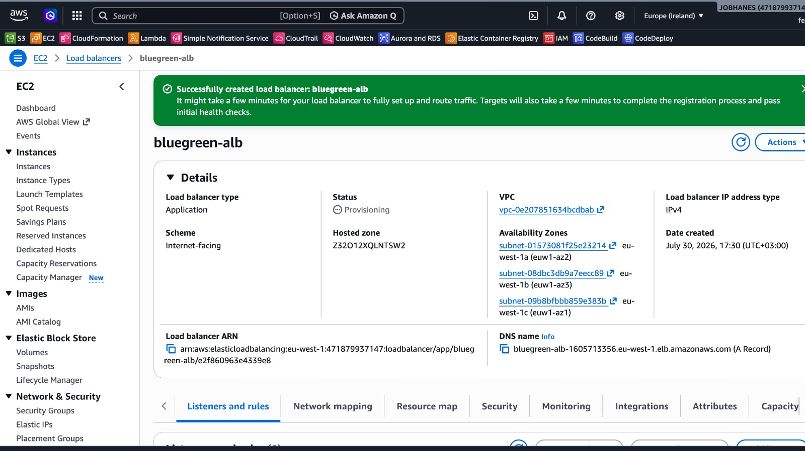

# AWS Blue-Green Deployment Strategy Capstone

## Project overview

This repository documents a complete AWS blue/green deployment strategy implemented for a Nairobi-based telecommunications provider serving customers across Kenya. The solution demonstrates a controlled release process for a web application running in Amazon EC2, using an Internet-facing Application Load Balancer, separate Blue and Green target groups, Amazon CloudWatch monitoring, and Amazon SNS notifications.

The repository is prepared for submission as a capstone project and is structured so that screenshots can be added later without changing the documentation flow.

## Business scenario

A telecommunications provider in Nairobi needs to modernize its customer-facing web service while preserving availability and reducing deployment risk. The business requirement is to deliver new application features without causing long service interruption. A blue/green deployment strategy provides a safer path by keeping the current production environment alive while validating a new version in parallel.

## Objectives

- Maintain separate Blue and Green environments for reliable release validation.
- Route production traffic initially to Blue.
- Deploy a candidate release to Green and validate it before switching traffic.
- Use an Application Load Balancer to shift traffic gradually and safely.
- Monitor the deployment with CloudWatch and notify stakeholders using SNS.
- Provide a rapid rollback path to Blue if validation fails.

## AWS Region

- Region: Europe (Ireland)
- Region code: eu-west-1

## Architecture

The deployment uses an Internet-facing Application Load Balancer with two target groups:

- Blue target group: blue-target-group
- Green target group: green-target-group

The architecture includes:

- Blue EC2 instance: blue-server
- Green EC2 instance: green-server
- Security group: bluegreen-web-sg
- Load balancer name: bluegreen-alb
- Health check protocol: HTTP
- Health check path: /
- Application port: 80

The architecture is documented in [architecture/blue-green-architecture.md](architecture/blue-green-architecture.md) and [architecture/architecture-description.md](architecture/architecture-description.md).

## AWS services used

- Amazon EC2
- Application Load Balancer
- Amazon CloudWatch
- Amazon SNS
- Amazon Linux 2023
- Security Groups

## Repository structure

- [architecture/blue-green-architecture.md](architecture/blue-green-architecture.md)
- [architecture/architecture-description.md](architecture/architecture-description.md)
- [deployment/validation-checklist.md](deployment/validation-checklist.md)
- [deployment/traffic-switch-guide.md](deployment/traffic-switch-guide.md)
- [deployment/rollback-plan.md](deployment/rollback-plan.md)
- [monitoring/monitored-metrics.md](monitoring/monitored-metrics.md)
- [monitoring/cloudwatch-alarm-configuration.md](monitoring/cloudwatch-alarm-configuration.md)
- [monitoring/sns-notification-configuration.md](monitoring/sns-notification-configuration.md)
- [reports/implementation-report.md](reports/implementation-report.md)
- [reports/testing-report.md](reports/testing-report.md)
- [reports/lessons-learned.md](reports/lessons-learned.md)
- [screenshots/README.md](screenshots/README.md)

## Environment preparation

Planned implementation:

- Launch two EC2 instances in eu-west-1.
- Apply the same base Amazon Linux 2023 configuration to both environments.
- Attach the same application port and health-check settings.
- Create the security group bluegreen-web-sg and assign it consistently.
- Register both instances with the ALB target groups.

Configuration performed:

- Blue environment is configured as the current production environment.
- Green environment is configured as the candidate release environment.
- Health checks are configured for HTTP on port 80 using the path /.

Validation evidence:

- Screenshots should be added to [screenshots/README.md](screenshots/README.md) and referenced here once uploaded.

## Blue environment deployment

The Blue environment represents Version 1 and is the current production environment. It is kept available during the deployment to reduce risk and support rollback.


## Green environment deployment

The Green environment represents Version 2 and is deployed as the candidate release. It is validated independently before production traffic is shifted.


## Target group configuration

The ALB uses two independent target groups:

- blue-target-group for the Blue environment
- green-target-group for the Green environment


## Application Load Balancer configuration

The load balancer is configured as an Internet-facing Application Load Balancer in eu-west-1. The listener on port 80 forwards traffic to the active target groups based on the configured forwarding rules.




## Green validation process

Planned implementation:

- Confirm both target groups are healthy.
- Validate the Green application page and health endpoint.
- Compare the application behavior with Blue.
- Review CloudWatch metrics and alarms before traffic switch.

Validation evidence:

- Status: Completed — attach screenshot
- Evidence pending: [screenshots/README.md](screenshots/README.md)


## Traffic-switching strategy

The traffic-switching strategy uses weighted target groups to move traffic gradually from Blue to Green. This approach reduces the blast radius of a deployment issue while preserving a reliable rollback path.

| Deployment stage | Blue weight | Green weight |
| --- | ---: | ---: |
| Initial production | 100% | 0% |
| Canary validation | 90% | 10% |
| Expanded validation | 50% | 50% |
| Full Green deployment | 0% | 100% |
| Rollback | 100% | 0% |

Weighted traffic shifting should be monitored through target health, HTTP 5xx errors, request count, and response time. The precise transition pace should be adjusted based on the workload and observed behavior.


## CloudWatch monitoring

The deployment should be monitored using CloudWatch metrics for the ALB and EC2 targets. Monitoring should focus on health, traffic volume, server errors, response time, and instance status.


## CloudWatch alarms

CloudWatch alarms should be created to notify the operations team when the deployment behaves abnormally. Example alarm names are documented in [monitoring/cloudwatch-alarm-configuration.md](monitoring/cloudwatch-alarm-configuration.md).


## SNS notifications

SNS should be used to send email notifications when alarms are triggered. This ensures that the deployment team receives timely alerts during validation and rollback.


## Manual rollback procedure

Planned implementation:

- Restore Blue traffic to 100% immediately if Green fails validation.
- Keep Blue running until Green has passed the agreed stability period.
- Review logs, alarms, and user-facing errors.

Configuration performed:

- The rollback plan is documented in [deployment/rollback-plan.md](deployment/rollback-plan.md).

Validation evidence:

- Status: To be verified
- Action: Run the rollback procedure and add the screenshot to [screenshots/README.md](screenshots/README.md).


## Optional automated rollback design

An optional future enhancement is to automate rollback through EventBridge and Lambda. In that design, a CloudWatch alarm would trigger EventBridge, which would invoke Lambda to adjust ALB listener weights and return traffic to Blue.

This is documented in [architecture/blue-green-architecture.md](architecture/blue-green-architecture.md).

## Deployment scripts

The repository includes Bash scripts for deployment support and validation:

- [scripts/blue-user-data.sh](scripts/blue-user-data.sh)
- [scripts/green-user-data.sh](scripts/green-user-data.sh)
- [scripts/smoke-test.sh](scripts/smoke-test.sh)
- [scripts/verify-environment.sh](scripts/verify-environment.sh)

## Smoke testing

The smoke-test script can be used to verify the environment availability and content before cutover.

```bash
./scripts/smoke-test.sh http://example-alb.eu-west-1.elb.amazonaws.com BLUE
./scripts/smoke-test.sh http://green-public-ip GREEN
```

## Test results

| Test area | Status |
| --- | --- |
| Blue instance direct access | To be verified |
| Green instance direct access | To be verified |
| Blue health endpoint | To be verified |
| Green health endpoint | To be verified |
| Blue target group health | To be verified |
| Green target group health | To be verified |
| ALB serving Blue | To be verified |
| 90/10 traffic configuration | To be verified |
| 50/50 traffic configuration | To be verified |
| Full Green cutover | To be verified |
| CloudWatch metrics visibility | To be verified |
| CloudWatch alarm behavior | To be verified |
| SNS email delivery | To be verified |
| Manual rollback | To be verified |
| Blue service restored after rollback | To be verified |

Update each status after the corresponding validation step is completed.

## Security considerations

- Do not expose secrets in scripts, configuration files, or screenshots.
- Restrict access to the ALB, EC2 instances, and monitoring resources using least-privilege access.
- Review security-group rules to allow only the required application port and health checks.
- Avoid including private IP addresses, account IDs, or access keys in shared documentation.

## Zero-downtime justification

The design is intended to minimize interruption rather than guarantee absolute zero downtime. Blue remains available during the Green validation phase, and traffic can be shifted gradually using weighted target groups. This reduces deployment risk and makes rollback straightforward.

## Lessons learned

The project-level lessons learned are summarized in [reports/lessons-learned.md](reports/lessons-learned.md).

## Cleanup procedure

After validation and demonstration, remove or stop temporary resources that are no longer needed. Retain the documentation and screenshots that support the deployment narrative. If the environment is being decommissioned, remove the EC2 instances, ALB, target groups, security groups, and monitoring resources in a controlled manner.

## Final outcome

This repository provides a structured narrative and supporting documentation for an AWS blue/green deployment strategy in eu-west-1. It is ready to be reviewed, tested, and enhanced with actual environment screenshots and validation evidence.

## Author

Jobhanes Bwire
