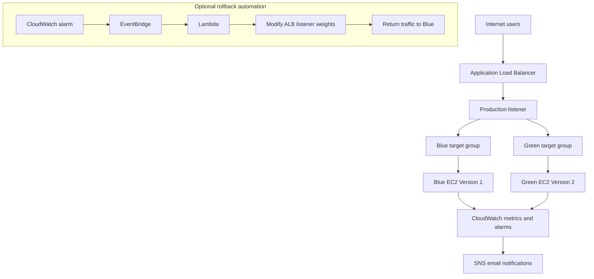

# Blue/Green Architecture

This document provides a high-level architecture view for the AWS blue/green deployment capstone.

## Mermaid diagram

## Notes

- Blue is retained as the current production environment during validation.
- Green is introduced as the candidate release and is evaluated before traffic is shifted.
- The optional rollback flow is a design enhancement and should be implemented only after the manual process is validated.
